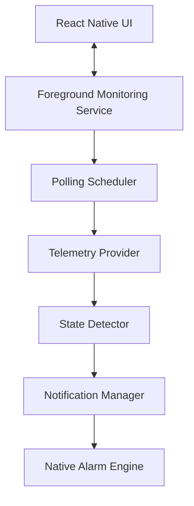

# SolarGuard Telemetry Monitoring Engine

This document provides an overview of the single telemetry monitoring architecture of SolarGuard, built around the Android Foreground Service.

## System Architecture

### Component Details

1. **React Native UI (`App.tsx` & Screens)**
   - Allows users to configure system preferences (refresh intervals, notification sound names, battery warning thresholds).
   - Unlocks Developer features via an Easter Egg flow to mock telemetry data or force alarm tests.

2. **Foreground Monitoring Service (`foregroundService.ts`)**
   - The single source of truth for telemetry monitoring.
   - Registers a sticky native Android service using `@notifee/react-native` to run continuously in the background.
   - Keeps the JavaScript (Hermes) engine active by triggering lightweight AsyncStorage I/O heartbeats every 30 seconds.

3. **Polling Scheduler (`foregroundService.ts` Loop)**
   - Executes periodic polls based on the user-configured refresh interval (e.g. 5 minutes).
   - Schedules requests relative to the completion of the previous request to avoid overlapping calls.
   - Persists state diagnostics (`sg_fs_state`, `sg_fs_last_poll`, `sg_fs_next_poll`, `sg_fs_last_result`) using memory cache filtering to optimize storage writes.

4. **Telemetry Provider (`api/solar.ts`)**
   - Fetches live data from the SolarOS REST API endpoints.
   - Resolves authentication: attempts to auto-refresh expired OAuth credentials using refresh tokens.
   - Gracefully handles failures: if authentication is un-refreshable, pauses loop executions, tags state as `Login Required`, and changes the persistent status card to notify the user.

5. **State Detector (`services/stateDetector.ts`)**
   - Receives raw telemetry payload and compares it against previous persistent grid status.
   - Evaluates transitions: checks for `'on' -> 'off'` (Power Cut) or `'off' -> 'on'` (Power Restored).
   - Triggers the emergency sirens when transition logic is satisfied.

6. **Notification Manager (`services/notifications.ts`)**
   - Configures native channels, schedules critical warnings, and triggers standard notification sound/popup packages.

7. **Alarm Engine (`modules/outage-alarm`)**
   - Custom native Android package that bypasses standard DND/Silent profiles (when enabled) to play siren loops at maximum volume.

---

## Service Lifespan & Recovery

- **App Force Close**: The service is registered sticky (`START_STICKY`). If the user forces closes the application, the OS automatically boots the monitoring service back up in the background.
- **Device Reboot**: Subscribed to boot receivers (`android.permission.RECEIVE_BOOT_COMPLETED`). The service auto-starts on boot to resume telemetry polling without requiring the user to open the app.
- **Connection Loss**: If a polling cycle fails due to network/server timeout, the service remains alive in a `Retrying` state, displaying a subtle notice on the notification card, and retries every 60 seconds.
